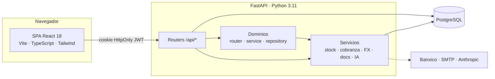

<div align="center">


# Atlas ONE · DASIC Industrial

**Plataforma ERP/CRM para empresas de servicios industriales**

Cotizador multimoneda · CRM de pipeline · Remisiones con entregas parciales · Inventario auditable · Cobranza con aging

<br>


<sub>**Producción** · autodeploy desde `main` · 228 endpoints · 25 módulos de UI · 53 migraciones</sub>

</div>

---

## Qué es

Atlas ONE digitaliza el ciclo comercial y operativo completo de DASIC Industrial: desde el prospecto hasta la entrega y el cobro. Sustituye la operación previa en Excel y Word por un sistema con trazabilidad documental, folios consecutivos irrepetibles, control de inventario auditable y precios calculados sobre **costo + utilidad** con protección cambiaria.

```
Prospecto → Oportunidad → Cotización → Venta → Compra → Entrega → Cobranza
     └── CRM Kanban        └── PDF/Word   └── OC     └── Remisión  └── Aging
```

Es también la base del producto SaaS **Atlas Industrial Services**: la identidad visual, los módulos y la terminología son configurables por tenant, con DASIC como primer cliente y design partner.

---

## Capacidades

| Área | Módulos |
|---|---|
| **Comercial** | Dashboard operativo · CRM Pipeline (Kanban con detalle de oportunidad, actividades y métricas de conversión) · **Cotizador** (costo+utilidad, multimoneda con TC direccional, versionado, plantillas, PDF/Word) · Borradores · Seguimiento · Recordatorios |
| **Clientes** | Empresas y contactos con deduplicación · **Plantas** y **activos instalados** (base instalada) · Estado de cuenta · Timeline de actividad |
| **Operación** | **Remisiones** (borrador → emitida → recibida/cancelada, entregas parciales con pendientes, conversión a cotización) · Compras y órdenes de compra desde cotización · Fantasmas · Reportes de servicio |
| **Catálogo** | Inventario costo-first con kardex y reservas · Servicios · Precios por proveedor · Diccionarios y catálogos SAT |
| **Finanzas** | Centro de cobranza con aging 0-30/31-60/61-90/90+ · Pagos distribuidos FIFO · Gastos · Tipo de cambio (Banxico) |
| **Plataforma** | Consola super-admin: usuarios, configuración en runtime, auditoría, salud del sistema y mantenimiento |

---

## Arquitectura



**Backend** — FastAPI con SQLAlchemy 2.x. Modelos particionados por dominio en `app/models/`, routers bajo `/api/*` y el patrón de referencia para módulos nuevos en `app/domains/<módulo>/` (router + service + repository + documentos). La lógica sensible vive en servicios: movimientos de stock, cobranza FIFO, tipo de cambio y generación documental.

**Frontend** — SPA servida por el propio backend desde `app/static/dist/`. Cada pantalla vive en `web/src/features/<x>/` con la misma anatomía (`types.ts` · `hooks/` · `pages/` · `components/`), construida sobre primitivas tokenizadas en `components/ui/`.

**Autenticación** — JWT en cookie HttpOnly, permisos por rol resueltos en el servidor con matriz de capacidades (`app/security/permissions.py`).

---

## Puesta en marcha

```bash
# 1 · Backend  (requiere DATABASE_URL y SECRET_KEY)
pip install -r requirements.txt
uvicorn app.main:app --reload            # API + Swagger en /docs

# 2 · Frontend  (Vite en :5173 con proxy a :8000)
cd web && npm install && npm run dev

# 3 · Build de producción  (obligatorio antes de push)
cd web && npm run build                  # genera app/static/dist/
```

| Variable | Requerida | Para qué |
|---|:--:|---|
| `DATABASE_URL` | ✅ | PostgreSQL (se normaliza a `postgresql+psycopg://`) |
| `SECRET_KEY` | ✅ | Firma de JWT — mínimo 32 caracteres, fija en producción |
| `BANXICO_TOKEN` | — | TC oficial DOF; sin él usa un proveedor público de respaldo |
| `ANTHROPIC_API_KEY` | — | Sugerencias comerciales asistidas por IA |
| `SMTP_*` | — | Envío de cotizaciones por correo |
| `SUPERADMIN_EMAIL` · `SUPERADMIN_PASSWORD` | — | Crea la cuenta de plataforma al arrancar |

> Guía completa en **[`docs/development/local-setup.md`](docs/development/local-setup.md)**.

---

## Estructura

```
.
├── app/                    Backend FastAPI
│   ├── domains/            Módulos con router · service · repository (patrón de referencia)
│   ├── models/             SQLAlchemy por dominio de negocio
│   ├── routers/            Endpoints /api/*
│   ├── schemas/            Contratos Pydantic
│   ├── services/           Stock · cobranza · FX · documentos · IA
│   ├── security/           JWT y matriz de permisos
│   └── static/dist/        Build de la SPA (commiteado)
├── web/src/
│   ├── features/           Una carpeta por pantalla
│   ├── components/ui/      Design system (primitivas tokenizadas)
│   ├── components/layout/   Shell: sidebar · header · footer
│   └── lib/                API, permisos, branding por tenant
├── migrations/             Alembic
├── tests/                  Suite pytest
└── docs/                   Documentación viva
```

---

## Reglas no negociables

| Regla | Por qué |
|---|---|
| **Folios, totales y stock se calculan en el servidor** | Consecutivos irrepetibles con bloqueo transaccional; el stock solo cambia mediante movimientos auditables |
| **Toda columna nueva necesita migración Alembic *y* entrada en `_BACKFILL_DDL`** | El despliegue no ejecuta Alembic: el backfill idempotente es el camino real a producción |
| **Re-exportar modelos y schemas nuevos en su `__init__.py`** | Omitirlo tumba el arranque y la compilación no lo detecta |
| **UI nueva solo en `web/src/features/`, con tokens semánticos** | Los `.html` de `app/templates/` son respaldo histórico; los colores crudos rompen el tema claro |
| **`npm run build` antes de cada push, con `dist/` commiteado** | El backend sirve ese build; sin él, producción queda desactualizada |

Detalle en **[`CLAUDE.md`](CLAUDE.md)** y **[`docs/development/coding-standards.md`](docs/development/coding-standards.md)**.

---

## Calidad

```bash
python3 -m compileall app                      # Sintaxis del backend
pip install -r requirements-dev.txt && pytest -q   # Suite backend: remisiones, folios, stock, formato
cd web && npm run typecheck                    # TypeScript estricto
cd web && npm run test                         # Vitest: motor de cálculo del cotizador
```

El motor de dinero —conversión multimoneda, utilidad, descuentos, IVA y redondeo por línea— está cubierto por pruebas con la aritmética verificada a mano. Plan de cobertura en **[`docs/development/testing.md`](docs/development/testing.md)**.

---

## Despliegue

Autodeploy en **Railway** desde `main`. El build del servidor solo instala dependencias de Python: **la SPA que sirve producción es el `dist/` commiteado**, por eso `npm run build` antes del push no es opcional. Al arrancar, la aplicación crea tablas nuevas, aplica el backfill idempotente de columnas y ejecuta los seeds. Verificación, rollback y variables en **[`docs/development/deployment.md`](docs/development/deployment.md)**.

---

## Documentación

| Documento | Contenido |
|---|---|
| [`docs/README.md`](docs/README.md) | Índice completo de la documentación |
| [`docs/Atlas-ONE-Proyecto.md`](docs/Atlas-ONE-Proyecto.md) | Panorama del producto: módulos, decisiones y gotchas |
| [`docs/product/`](docs/product/) | Evolución a CPQ · plan móvil del cotizador · análisis de remisiones |
| [`docs/current-state/`](docs/current-state/) | Auditorías de arquitectura, deuda técnica y UX |
| [`docs/development/`](docs/development/) | Setup local · convenciones · pruebas · despliegue |
| [`CLAUDE.md`](CLAUDE.md) | Reglas operativas para agentes de IA que trabajen en el repo |

---

<div align="center">
<br>

**Atlas Tech**

<sub>Atlas ONE es parte de **Atlas Industrial Services**, la plataforma vertical<br>para empresas que venden, ejecutan y mantienen soluciones industriales.</sub>

<br>

<sub>© 2026 Atlas Tech · Desarrollado para DASIC Industrial</sub>

</div>
