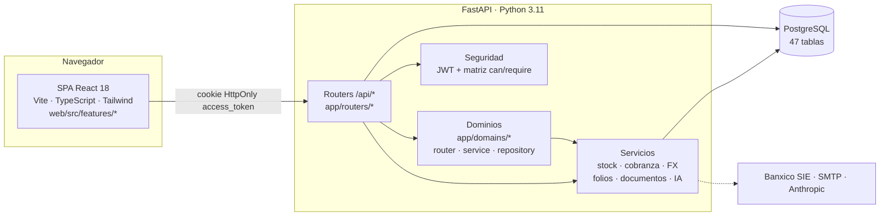
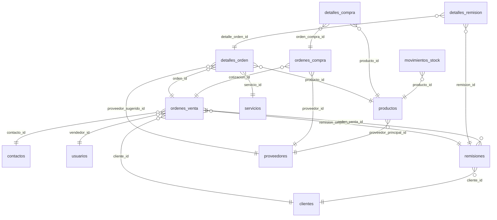
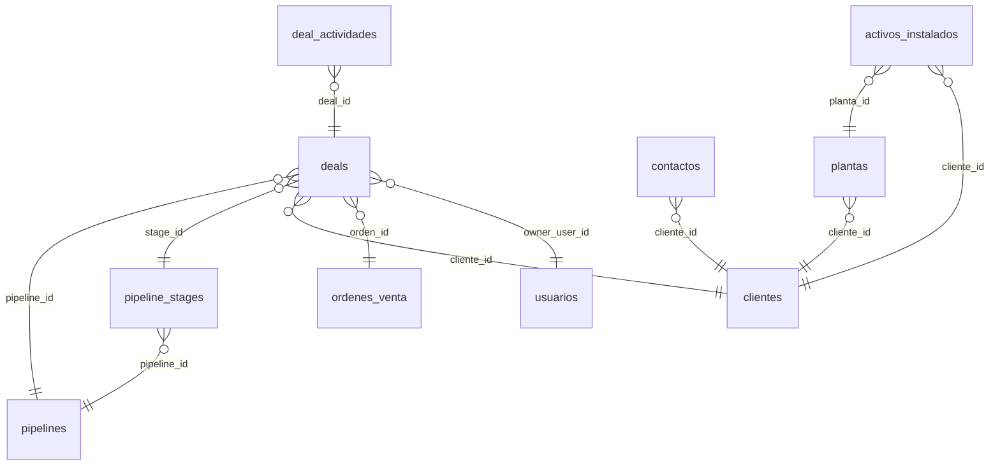
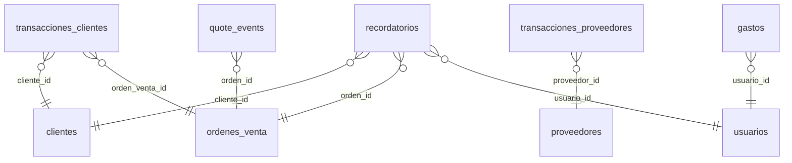

<div align="center">

# Documentación Técnica

### Atlas ONE · DASIC Industrial

<sub>Arquitectura · Modelos · Schemas · Diccionario de datos</sub>

<sub>Generado el 2026-08-19 a partir de `Base.metadata` (47 tablas) — regenerable, no editar el diccionario a mano</sub>

</div>

---

## Índice

1. [Arquitectura](#1-arquitectura)
2. [Mapa del backend](#2-mapa-del-backend)
3. [Mapa del frontend](#3-mapa-del-frontend)
4. [Modelos de dominio](#4-modelos-de-dominio)
5. [Enums de dominio](#5-enums-de-dominio)
6. [Diagramas entidad-relación](#6-diagramas-entidad-relación)
7. [Diccionario de datos](#7-diccionario-de-datos)
8. [Schemas Pydantic](#8-schemas-pydantic)
9. [Convenciones transversales](#9-convenciones-transversales)

---

## 1 · Arquitectura

Atlas ONE es un monolito **FastAPI + PostgreSQL** que sirve su propia SPA **React 18**. Un solo proceso atiende la API (`/api/*`), los assets estáticos y el `index.html` del build para toda ruta `/spa/*`.



### Arranque (`app/main.py` → `app/core/lifespan.py` → `app/db/seeds.py`)

1. `configure_logging()` y `get_settings()` — cachea y **valida `DATABASE_URL` y `SECRET_KEY`**; la app se niega a arrancar sin ellas. `normalize_database_url` reescribe `postgres://` → `postgresql+psycopg://`.
2. `lifespan`: `Base.metadata.create_all()` (transicional) y `run_all_seeds()`:
   - `run_backfill_ddl` — `ALTER TABLE … ADD COLUMN IF NOT EXISTS` idempotente para esquemas legacy (el deploy **no** ejecuta Alembic; este backfill es el camino real a producción).
   - Seeds: superadmin, marcas, catálogos SAT, contactos principales, pipeline por defecto, unidades.
3. Routers montados bajo `/api/*`; toda ruta `/spa/*` devuelve el `index.html` del build commiteado en `app/static/dist/`.

### Autenticación y permisos

- **JWT** (`python-jose`) en cookie **HttpOnly `access_token`**; la API acepta también `Authorization: Bearer`. El login es la única página Jinja restante (`/`).
- **Matriz declarativa** en `app/security/permissions.py`: `can(user, action, resource)` / `require(...)`, con variantes `:own` y `scope_query_by_owner()` — mecanismo preferido (lo usa `app/domains/remisiones/`).
- **Helpers históricos** en `app/security/jwt.py` (`allow_admin`, `allow_all_staff`, …) — aún en la mayoría de routers; migrarlos a la matriz es mejora bienvenida al tocarlos.

### Decisión de producto

El sistema es **mono-empresa, dedicado a DASIC** (decisión 2026-08-19). El esquema multi-tenant fue retirado (`20260429_01_drop_multitenant`); `organization_id` sobrevive como columna inerte en 5 tablas y **no implica aislamiento**. `branding.ts` y `platform_config` son configuración, no multi-tenancy.

---

## 2 · Mapa del backend

### Routers (`app/routers/` · 24 módulos · ~250 endpoints)

| Router | Endpoints | Responsabilidad |
|---|:--:|---|
| `ventas.py` | 26 | Cotizador: CRUD de cotizaciones/ventas, folios, versionado, TC direccional, PDF/Word |
| `clientes.py` | 27 | Empresas: CRUD, deduplicación/fusión, estado de cuenta, timeline, notas |
| `compras.py` | 16 | Órdenes de compra, borrador de OC desde cotización, recepción |
| `catalogos.py` | 15 | Marcas, diccionarios y catálogos administrables |
| `crm.py` | 14 | Pipelines, etapas, deals Kanban, actividades, métricas de conversión |
| `sat.py` | 14 | Catálogos SAT (claves prod/serv, unidades, uso CFDI, …) |
| `productos.py` | 12 | Catálogo costo-first, kardex, reservas |
| `reportes.py` | 10 | Reportes y analítica |
| `servicios.py` | 9 | Catálogo de servicios |
| `plantas.py` | 8 | Plantas y activos instalados por cliente |
| `dashboard.py` | 7 | KPIs y alertas del tablero |
| `superadmin.py` | 7 | Consola de plataforma: config runtime, salud, mantenimiento |
| `fantasmas.py` | 6 | Productos fantasma (líneas fuera de catálogo con seguimiento a OC) |
| `recordatorios.py` | 6 | Recordatorios ligados a clientes/órdenes |
| `cuentas_por_cobrar.py` | 5 | Cobranza: aging, aplicación de pagos FIFO |
| `gastos.py` | 5 | Gastos internos |
| `usuarios.py` | 5 | Administración de usuarios y roles |
| `reportes_servicio_docs.py` | 5 | Documentos de reportes de servicio |
| `fx.py` | 4 | Tipo de cambio USD/MXN (Banxico + refresh admin) |
| `inventario.py` | 4 | Movimientos de stock y ajustes |
| `precios.py` | 4 | Precios por proveedor y comparador |
| `auth.py` | 3 | Login/logout/sesión |
| `admin.py` | 2 | Utilidades administrativas |
| `contactos.py` | 2 | Contactos de empresas |

### Dominios (`app/domains/` — patrón de referencia para código nuevo)

```
app/domains/remisiones/
├── router.py        HTTP: validación, require(permisos), códigos de estado
├── service.py       Reglas de negocio y transacciones (estados, entregas parciales, BR-05)
├── repository.py    Consultas y agregados
├── schemas.py       Pydantic del módulo
├── documents.py     PDF/impresión de la remisión
└── templates/       Jinja en archivo (nunca HTML inline)
```

### Servicios (`app/services/`)

| Servicio | Responsabilidad |
|---|---|
| `folio_service.py` | **Folios consecutivos irrepetibles**: advisory lock + `MAX(folio)` + regex (`COT-YYYYMM-INICIALES-NNNN`) |
| `stock_service.py` | **Única puerta al stock**: `aplicar_movimiento` registra `movimientos_stock`; disponible = stock − reservas |
| `cuentas_por_cobrar.py` | Aging 0-30/31-60/61-90/90+ y distribución FIFO de pagos |
| `fx_service.py` | TC del día con cache en `tipos_cambio_dia`; Banxico SIE (SF63528) con fallback público |
| `formato.py` | `fmt_cantidad`: máx 2 decimales sin ceros colgantes (obligatorio en documentos) |
| `word_service.py` | Generación de cotizaciones Word |
| `auto_oc_service.py` | Borrador de OC a partir de una cotización |
| `fantasmas_service.py` | Ciclo de vida de productos fantasma |
| `config_service.py` | Configuración de plataforma en runtime (`platform_config`) |
| `email_service.py` | Envío SMTP de cotizaciones |
| `ai_service.py` | Sugerencias comerciales (SDK de Anthropic) |

---

## 3 · Mapa del frontend

SPA en `web/` (React 18 + Vite 5 + TypeScript + Tailwind + shadcn/ui + Zustand + TanStack Query v5). Cada pantalla vive en `web/src/features/<x>/` con anatomía uniforme: `types.ts` · `hooks/` · `pages/` · `components/`.

**25 features:** `analitica` · `auth` · `borradores` · `catalogos` · `clientes` · `compras` · `contactos` · `cotizador` · `crm` · `cxc` · `dashboard` · `fantasmas` · `fx` · `gastos` · `inventario` · `precios` · `recordatorios` · `remisiones` · `reportes` · `reportes_servicio` · `reportes_servicio_docs` · `seguimiento` · `servicios` · `superadmin` · `usuarios`

Primitivas del design system en `web/src/components/ui/` (tokens semánticos, cero colores crudos); componentes documentales compartidos en `web/src/components/document/`; API/permisos/branding en `web/src/lib/`. El build (`npm run build`) genera `app/static/dist/`, que **se commitea** — es el frontend que sirve producción.

---

## 4 · Modelos de dominio

`app/models/` está particionado por dominio de negocio — no existen archivos catch-all:

| Archivo | Clases (tabla) | Dominio |
|---|---|---|
| `users.py` | `Usuario` | Cuentas y roles (tolera aliases legacy de enum al leer) |
| `clients.py` | `Cliente`, `Proveedor`, `Contacto`, `NotaEmpresa`, `ClienteMergeLog` | Empresas, contactos y auditoría de fusiones |
| `catalog.py` | `Producto`, `Promocion`, `Marca` | Catálogo costo-first (`costo_compra` + `moneda_compra`) |
| `fantasmas.py` | `ProductoFantasma` | Líneas fuera de catálogo con seguimiento a OC |
| `precios.py` | `PrecioProveedor` | Precios por proveedor y comparador |
| `inventory.py` | `MovimientoStock` | Rastro auditable de inventario |
| `sales.py` | `OrdenVenta`, `DetalleOrden` | Cotizaciones y ventas (multimoneda, versionado, líneas ad-hoc) |
| `plantillas.py` | `PlantillaCotizacion` | Plantillas del cotizador |
| `purchases.py` | `OrdenCompra`, `DetalleCompra` | Compras ligadas a cotización |
| `remisiones.py` | `Remision`, `DetalleRemision` | Entregas con estados y parciales (`Numeric(12,3)`) |
| `finance.py` | `TransaccionCliente`, `TransaccionProveedor` | Cargos/abonos de clientes y proveedores |
| `expenses.py` | `Gasto` | Gastos internos |
| `fx.py` | `TipoCambioDia` | Cache diario del tipo de cambio |
| `crm.py` | `Pipeline`, `PipelineStage`, `Deal`, `DealActividad` | Pipeline comercial |
| `instalaciones.py` | `Planta`, `ActivoInstalado` | Base instalada del cliente |
| `services.py` | `Servicio` | Catálogo de servicios |
| `reportes_servicio.py` | `ReporteServicio` | Reportes de servicio en campo |
| `quote_events.py` | `QuoteEvent` | Auditoría por cotización (correo, WhatsApp, IA) |
| `recordatorios.py` | `Recordatorio` | Recordatorios ligados a clientes/órdenes |
| `unidades.py` | `UnidadMedida` | Catálogo comercial de unidades |
| `platform.py` | `PlatformConfig` | Configuración en runtime |
| `sat.py` | 12 clases `Sat*` | Catálogos fiscales SAT |
| `enums.py` | — | Enums de dominio (ver §5) |

`app/schemas/` espeja esta partición para los contratos Pydantic (ver §8).

---

## 5 · Enums de dominio

| Enum | Valores | Uso |
|---|---|---|
| `RolUsuario` | `superadmin` · `admin` · `asistente` · `vendedor` · `operativo` | `usuarios.rol` — mapean a SUPERADMIN / ADMINISTRADOR / GERENTE_COMERCIAL / VENTAS / OPERATIVO |
| `EstatusOrden` | `cotizacion` · `pendiente` · `pagada` · `cancelada` | Ciclo de vida de `ordenes_venta` |
| `EstadoRemision` | `borrador` · `emitida` · `recibida` · `cancelada` | Ciclo de vida de `remisiones` |
| `TipoMovimientoStock` | `entrada` · `salida` · `ajuste` · `reserva` · `liberacion` | `movimientos_stock.tipo` |
| `TipoMovimiento` | `cargo` · `abono` | Transacciones de clientes y proveedores |
| `TipoLineaCotizacion` | `producto_catalogo` · `producto_fantasma` · `servicio` | Naturaleza de cada `detalles_orden` |

---

## 6 · Diagramas entidad-relación

Se muestran las relaciones transaccionales; las FKs de auditoría hacia `usuarios` (`creado_por_id`, `emitida_por_id`, …) existen en casi todas las tablas y se omiten del dibujo por legibilidad — están completas en el diccionario (§7).

### Ciclo comercial — cotización → compra → entrega → stock



### CRM y clientes



### Finanzas y seguimiento



---

## 7 · Diccionario de datos

47 tablas, agrupadas por el módulo de `app/models/` que las define. 🔑 = clave primaria; _(único)_ / _(idx)_ = restricción o índice de columna; la columna **Referencia** indica la FK.

### Usuarios y seguridad — `app/models/users.py`


#### `usuarios` · clase `Usuario`

| Columna | Tipo | Nulo | Default | Referencia |
|---|---|:--:|---|---|
| **id** 🔑 | `integer` | NO |  |  |
| nombre | `varchar(100)` | NO |  |  |
| email _(único, idx)_ | `varchar(100)` | NO |  |  |
| password_hash | `varchar(200)` | NO |  |  |
| rol | `varchar(17)` |  | RolUsuario.VENTAS |  |
| activo | `boolean` |  | True |  |


### Clientes y proveedores — `app/models/clients.py`


#### `cliente_merge_log` · clase `ClienteMergeLog`

> Auditoría de fusiones de empresas (Sub-3). Sin FK a clientes a propósito:

| Columna | Tipo | Nulo | Default | Referencia |
|---|---|:--:|---|---|
| **id** 🔑 | `integer` | NO |  |  |
| survivor_id _(idx)_ | `integer` |  |  |  |
| loser_id _(idx)_ | `integer` |  |  |  |
| loser_nombre | `varchar(150)` |  |  |  |
| loser_rfc | `varchar(50)` |  |  |  |
| loser_saldo | `decimal(12, 2)` |  |  |  |
| n_ordenes | `integer` |  |  |  |
| n_transacciones | `integer` |  |  |  |
| n_remisiones | `integer` |  |  |  |
| n_contactos | `integer` |  |  |  |
| merged_by_id | `integer` |  |  |  |
| merged_at | `timestamp` |  | now() |  |


#### `clientes` · clase `Cliente`

| Columna | Tipo | Nulo | Default | Referencia |
|---|---|:--:|---|---|
| **id** 🔑 | `integer` | NO |  |  |
| nombre_empresa _(idx)_ | `varchar(150)` |  |  |  |
| contacto_nombre | `varchar(100)` |  |  |  |
| rfc_tax_id | `varchar(50)` |  |  |  |
| email | `varchar(100)` |  |  |  |
| telefono | `varchar(20)` |  |  |  |
| direccion | `text` |  |  |  |
| saldo_actual | `decimal(12, 2)` |  | 0.0 |  |
| limite_credito | `decimal(12, 2)` | NO | 0 |  |
| dias_credito | `integer` | NO | 0 |  |
| dia_corte | `integer` |  |  |  |
| moneda_credito | `varchar(3)` | NO | MXN |  |
| estatus | `varchar(12)` | NO | activo |  |
| creado_por_id _(idx)_ | `integer` |  |  | → `usuarios.id` |


#### `contactos` · clase `Contacto`

> Persona de contacto de una empresa (cliente). Varias por empresa.

| Columna | Tipo | Nulo | Default | Referencia |
|---|---|:--:|---|---|
| **id** 🔑 | `integer` | NO |  |  |
| cliente_id _(idx)_ | `integer` | NO |  | → `clientes.id` |
| nombre | `varchar(120)` | NO |  |  |
| cargo | `varchar(80)` |  |  |  |
| email | `varchar(120)` |  |  |  |
| telefono | `varchar(40)` |  |  |  |
| es_principal | `boolean` | NO | false |  |
| creado_en | `timestamp` | NO | now() |  |


#### `notas_empresa` · clase `NotaEmpresa`

> Bitácora append-only por empresa (sub vista 360). Solo crear/borrar.

| Columna | Tipo | Nulo | Default | Referencia |
|---|---|:--:|---|---|
| **id** 🔑 | `integer` | NO |  |  |
| cliente_id _(idx)_ | `integer` | NO |  | → `clientes.id` |
| autor_id | `integer` |  |  | → `usuarios.id` |
| texto | `text` | NO |  |  |
| creado_en | `timestamp` |  | now() |  |


#### `proveedores` · clase `Proveedor`

| Columna | Tipo | Nulo | Default | Referencia |
|---|---|:--:|---|---|
| **id** 🔑 | `integer` | NO |  |  |
| nombre_empresa _(idx)_ | `varchar(150)` |  |  |  |
| contacto_nombre | `varchar(100)` |  |  |  |
| telefono | `varchar(20)` |  |  |  |
| email | `varchar(100)` |  |  |  |
| saldo_actual | `decimal(12, 2)` |  | 0.0 |  |


### Catálogo de productos — `app/models/catalog.py`


#### `marcas` · clase `Marca`

> Taxonomía de marcas para SKU interno y agrupación de catálogo.

| Columna | Tipo | Nulo | Default | Referencia |
|---|---|:--:|---|---|
| **id** 🔑 | `integer` | NO |  |  |
| abreviatura _(único, idx)_ | `varchar(20)` | NO |  |  |
| nombre | `varchar(150)` | NO |  |  |
| categoria | `varchar(150)` |  |  |  |
| creado_en | `timestamp` |  | now() |  |
| actualizado_en | `timestamp` |  | now() |  |


#### `productos` · clase `Producto`

| Columna | Tipo | Nulo | Default | Referencia |
|---|---|:--:|---|---|
| **id** 🔑 | `integer` | NO |  |  |
| sku _(único, idx)_ | `varchar(50)` | NO |  |  |
| sku_comercial _(idx)_ | `varchar(80)` |  |  |  |
| nombre _(idx)_ | `varchar(150)` | NO |  |  |
| descripcion | `text` |  |  |  |
| imagen_url | `varchar(255)` |  |  |  |
| marca _(idx)_ | `varchar(80)` |  |  |  |
| marca_id _(idx)_ | `integer` |  |  | → `marcas.id` |
| unidad | `varchar(20)` |  | PZA |  |
| proveedor_principal_id _(idx)_ | `integer` |  |  | → `proveedores.id` |
| proveedor_alterno_id | `integer` |  |  | → `proveedores.id` |
| tiempo_entrega_dias | `integer` | NO | 7 |  |
| es_servicio | `boolean` | NO | False |  |
| stock_actual | `integer` |  | 0 |  |
| stock_minimo | `integer` |  | 5 |  |
| moneda_compra | `varchar(3)` | NO | MXN |  |
| costo_compra | `decimal(10, 2)` |  | 0.0 |  |
| precio_publico | `decimal(10, 2)` |  | 0.0 |  |
| precio_mayorista | `decimal(10, 2)` |  | 0.0 |  |
| precio_distribuidor | `decimal(10, 2)` |  | 0.0 |  |
| clave_prod_serv _(idx)_ | `varchar(8)` |  |  |  |
| clave_unidad_sat | `varchar(10)` |  |  |  |
| objeto_imp | `varchar(2)` |  |  |  |
| descripcion_fiscal | `text` |  |  |  |
| categoria _(idx)_ | `varchar(80)` |  |  |  |


#### `promociones` · clase `Promocion`

| Columna | Tipo | Nulo | Default | Referencia |
|---|---|:--:|---|---|
| **id** 🔑 | `integer` | NO |  |  |
| producto_id | `integer` |  |  | → `productos.id` |
| nombre_promo | `varchar(100)` |  |  |  |
| descuento_porcentaje | `integer` |  |  |  |
| fecha_inicio | `timestamp` |  |  |  |
| fecha_fin | `timestamp` |  |  |  |
| activa | `boolean` |  | True |  |


### Productos fantasma — `app/models/fantasmas.py`


#### `productos_fantasma` · clase `ProductoFantasma`

| Columna | Tipo | Nulo | Default | Referencia |
|---|---|:--:|---|---|
| **id** 🔑 | `integer` | NO |  |  |
| descripcion_normalizada _(idx)_ | `varchar(500)` | NO |  |  |
| descripcion_original | `text` | NO |  |  |
| sku_libre _(idx)_ | `varchar(80)` |  |  |  |
| marca | `varchar(80)` |  |  |  |
| marca_id _(idx)_ | `integer` |  |  | → `marcas.id` |
| clave_prod_serv | `varchar(8)` |  |  |  |
| clave_unidad_sat | `varchar(10)` |  |  |  |
| observaciones | `text` |  |  |  |
| costo_referencia | `decimal(12, 2)` | NO |  |  |
| moneda_referencia | `varchar(3)` | NO | MXN |  |
| proveedor_sugerido_id | `integer` |  |  | → `proveedores.id` |
| estado _(idx)_ | `varchar(20)` | NO | PENDIENTE |  |
| promovido_a_producto_id | `integer` |  |  | → `productos.id` |
| veces_solicitado | `integer` | NO | 1 |  |
| creado_en | `timestamp` | NO | now() |  |
| ultimo_visto_en | `timestamp` | NO | now() |  |


### Precios por proveedor — `app/models/precios.py`


#### `precios_proveedor` · clase `PrecioProveedor`

| Columna | Tipo | Nulo | Default | Referencia |
|---|---|:--:|---|---|
| **id** 🔑 | `integer` | NO |  |  |
| proveedor_id _(idx)_ | `integer` | NO |  | → `proveedores.id` |
| producto_id _(idx)_ | `integer` |  |  | → `productos.id` |
| descripcion_busqueda _(idx)_ | `varchar(500)` |  |  |  |
| sku_libre _(idx)_ | `varchar(80)` |  |  |  |
| precio | `decimal(12, 2)` | NO |  |  |
| moneda | `varchar(3)` | NO | MXN |  |
| fecha_vigencia_desde | `date` | NO | CURRENT_DATE |  |
| fecha_vigencia_hasta | `date` |  |  |  |
| notas | `text` |  |  |  |
| fuente | `varchar(20)` | NO | MANUAL |  |
| referencia_oc_id | `integer` |  |  | → `ordenes_compra.id` |
| creado_por_id | `integer` |  |  | → `usuarios.id` |
| creado_en | `timestamp` | NO | now() |  |


### Inventario auditable — `app/models/inventory.py`


#### `movimientos_stock` · clase `MovimientoStock`

| Columna | Tipo | Nulo | Default | Referencia |
|---|---|:--:|---|---|
| **id** 🔑 | `integer` | NO |  |  |
| producto_id _(idx)_ | `integer` | NO |  | → `productos.id` |
| tipo | `varchar(20)` | NO |  |  |
| cantidad | `integer` | NO |  |  |
| referencia_tipo | `varchar(20)` |  |  |  |
| referencia_id _(idx)_ | `integer` |  |  |  |
| motivo | `text` |  |  |  |
| usuario_id | `integer` |  |  | → `usuarios.id` |
| creado_en _(idx)_ | `timestamp` | NO | now() |  |
| stock_resultante | `integer` | NO |  |  |


### Ventas y cotizaciones — `app/models/sales.py`


#### `detalles_orden` · clase `DetalleOrden`

| Columna | Tipo | Nulo | Default | Referencia |
|---|---|:--:|---|---|
| **id** 🔑 | `integer` | NO |  |  |
| orden_id | `integer` |  |  | → `ordenes_venta.id` |
| producto_id | `integer` |  |  | → `productos.id` |
| servicio_id _(idx)_ | `integer` |  |  | → `servicios.id` |
| sku_libre | `varchar(80)` |  |  |  |
| descripcion_libre | `text` |  |  |  |
| moneda_origen_linea | `varchar(3)` |  |  |  |
| costo_base_linea | `decimal(12, 2)` |  |  |  |
| clave_prod_serv | `varchar(8)` |  |  |  |
| clave_unidad_sat | `varchar(10)` |  |  |  |
| marca | `varchar(80)` |  |  |  |
| mostrar_marca | `boolean` | NO | false |  |
| cantidad | `numeric(12, 3)` | NO |  |  |
| unidad | `varchar(20)` |  |  |  |
| precio_unitario | `decimal(10, 2)` | NO |  |  |
| utilidad_aplicada | `decimal(10, 2)` |  | 0.0 |  |
| descuento_aplicado | `decimal(10, 2)` |  | 0.0 |  |
| descuento_proveedor | `decimal(5, 2)` | NO | 0 |  |
| subtotal | `decimal(12, 2)` | NO |  |  |
| tipo_linea | `varchar(20)` | NO | producto_catalogo |  |
| proveedor_sugerido_id | `integer` |  |  | → `proveedores.id` |
| fantasma_id _(idx)_ | `integer` |  |  | → `productos_fantasma.id` |
| entrega_min | `integer` |  |  |  |
| entrega_max | `integer` |  |  |  |
| entrega_unidad | `varchar(10)` |  |  |  |
| observaciones_linea | `text` |  |  |  |


#### `ordenes_venta` · clase `OrdenVenta`

| Columna | Tipo | Nulo | Default | Referencia |
|---|---|:--:|---|---|
| **id** 🔑 | `integer` | NO |  |  |
| folio _(único, idx)_ | `varchar(40)` |  |  |  |
| cliente_id | `integer` |  |  | → `clientes.id` |
| contacto_id | `integer` |  |  | → `contactos.id` |
| vendedor_id | `integer` |  |  | → `usuarios.id` |
| fecha_creacion | `date` |  | hoy_negocio() |  |
| fecha_vencimiento | `date` |  |  |  |
| estatus | `varchar(50)` |  | EstatusOrden.COTIZACION |  |
| moneda | `varchar(3)` | NO | MXN |  |
| tipo_cambio | `decimal(12, 6)` | NO | 1.0 |  |
| tc_mn_a_usd | `decimal(12, 6)` |  |  |  |
| tc_usd_a_mn | `decimal(12, 6)` |  |  |  |
| tolerancia_tc | `decimal(3, 2)` | NO | 1.0 |  |
| total | `decimal(12, 2)` |  | 0.0 |  |
| observaciones | `text` |  |  |  |
| terminos_condiciones | `text` |  |  |  |
| pdf_unificado | `integer` | NO | 0 |  |
| concepto_unificado | `text` |  |  |  |
| cotizacion_origen_id _(idx)_ | `integer` |  |  | → `ordenes_venta.id` |
| version | `integer` | NO | 1 |  |
| remision_origen_id _(idx)_ | `integer` |  |  | → `remisiones.id` |
| enviada_at _(idx)_ | `timestamp` |  |  |  |
| pdf_generado_at | `timestamp` |  |  |  |
| actualizado_en | `timestamp` | NO | now() |  |


### Plantillas de cotización — `app/models/plantillas.py`


#### `plantillas_cotizacion` · clase `PlantillaCotizacion`

> Combinación de líneas frecuente que un usuario puede recargar.

| Columna | Tipo | Nulo | Default | Referencia |
|---|---|:--:|---|---|
| **id** 🔑 | `integer` | NO |  |  |
| nombre | `varchar(120)` | NO |  |  |
| descripcion | `text` |  |  |  |
| usuario_id _(idx)_ | `integer` |  |  | → `usuarios.id` |
| lineas | `text` | NO | [] |  |
| creado_en | `timestamp` | NO | now() |  |


### Compras — `app/models/purchases.py`


#### `detalles_compra` · clase `DetalleCompra`

| Columna | Tipo | Nulo | Default | Referencia |
|---|---|:--:|---|---|
| **id** 🔑 | `integer` | NO |  |  |
| orden_compra_id | `integer` |  |  | → `ordenes_compra.id` |
| producto_id | `integer` |  |  | → `productos.id` |
| sku_libre | `varchar(80)` |  |  |  |
| descripcion_libre | `varchar(255)` |  |  |  |
| moneda_origen_linea | `varchar(3)` |  |  |  |
| costo_base_linea | `decimal(12, 2)` |  |  |  |
| cantidad | `integer` | NO |  |  |
| costo_unitario | `decimal(10, 2)` | NO |  |  |
| marca | `varchar(80)` |  |  |  |
| clave_prod_serv | `varchar(8)` |  |  |  |
| clave_unidad_sat | `varchar(10)` |  |  |  |
| cantidad_recibida | `integer` | NO | 0 |  |
| fecha_recepcion | `timestamp` |  |  |  |


#### `ordenes_compra` · clase `OrdenCompra`

| Columna | Tipo | Nulo | Default | Referencia |
|---|---|:--:|---|---|
| **id** 🔑 | `integer` | NO |  |  |
| proveedor_id | `integer` |  |  | → `proveedores.id` |
| fecha | `timestamp` |  | now() |  |
| total | `decimal(12, 2)` |  |  |  |
| estatus | `varchar(20)` |  | borrador |  |
| folio _(único, idx)_ | `varchar(40)` |  |  |  |
| moneda | `varchar(3)` | NO | MXN |  |
| tipo_cambio | `decimal(12, 6)` | NO | 1.0 |  |
| cotizacion_id _(idx)_ | `integer` |  |  | → `ordenes_venta.id` |


### Remisiones — `app/models/remisiones.py`


#### `detalles_remision` · clase `DetalleRemision`

| Columna | Tipo | Nulo | Default | Referencia |
|---|---|:--:|---|---|
| **id** 🔑 | `integer` | NO |  |  |
| remision_id _(idx)_ | `integer` | NO |  | → `remisiones.id` |
| detalle_orden_id | `integer` |  |  | → `detalles_orden.id` |
| descripcion | `text` | NO |  |  |
| sku | `varchar(80)` |  |  |  |
| cantidad | `numeric(12, 3)` | NO |  |  |
| unidad | `varchar(20)` |  |  |  |
| observaciones_linea | `text` |  |  |  |
| clave_unidad_sat | `varchar(10)` |  |  |  |
| precio_unitario | `decimal(10, 2)` |  |  |  |
| subtotal | `decimal(12, 2)` |  |  |  |


#### `remisiones` · clase `Remision`

| Columna | Tipo | Nulo | Default | Referencia |
|---|---|:--:|---|---|
| **id** 🔑 | `integer` | NO |  |  |
| folio _(único, idx)_ | `varchar(40)` |  |  |  |
| orden_venta_id _(idx)_ | `integer` |  |  | → `ordenes_venta.id` |
| cliente_id _(idx)_ | `integer` |  |  | → `clientes.id` |
| fecha_remision | `timestamp` | NO | now() |  |
| transportista | `varchar(150)` |  |  |  |
| recibido_por | `varchar(150)` |  |  |  |
| recibido_at | `timestamp` |  |  |  |
| observaciones | `text` |  |  |  |
| moneda | `varchar(3)` |  |  |  |
| mostrar_precios | `boolean` | NO | false |  |
| creado_por_id | `integer` |  |  | → `usuarios.id` |
| creado_en | `timestamp` | NO | now() |  |
| estado _(idx)_ | `varchar(50)` | NO | 'BORRADOR' |  |
| emitida_at | `timestamp` |  |  |  |
| emitida_por_id | `integer` |  |  | → `usuarios.id` |
| cancelada_at | `timestamp` |  |  |  |
| cancelada_por_id | `integer` |  |  | → `usuarios.id` |
| motivo_cancelacion | `text` |  |  |  |
| sobre_entrega_autorizada_por_id | `integer` |  |  | → `usuarios.id` |
| stock_descontado | `boolean` | NO | false |  |


### Finanzas — transacciones — `app/models/finance.py`


#### `transacciones_clientes` · clase `TransaccionCliente`

| Columna | Tipo | Nulo | Default | Referencia |
|---|---|:--:|---|---|
| **id** 🔑 | `integer` | NO |  |  |
| cliente_id | `integer` |  |  | → `clientes.id` |
| tipo | `varchar(50)` |  |  |  |
| monto | `decimal(12, 2)` | NO |  |  |
| fecha | `timestamp` |  | now() |  |
| descripcion | `varchar(200)` |  |  |  |
| referencia_id | `integer` |  |  |  |
| orden_venta_id _(idx)_ | `integer` |  |  | → `ordenes_venta.id` |
| fecha_vencimiento | `date` |  |  |  |
| estatus_pago _(idx)_ | `varchar(20)` | NO | pendiente |  |
| monto_pagado | `decimal(12, 2)` | NO | 0 |  |


#### `transacciones_proveedores` · clase `TransaccionProveedor`

| Columna | Tipo | Nulo | Default | Referencia |
|---|---|:--:|---|---|
| **id** 🔑 | `integer` | NO |  |  |
| proveedor_id | `integer` |  |  | → `proveedores.id` |
| tipo | `varchar(50)` |  |  |  |
| monto | `decimal(12, 2)` | NO |  |  |
| fecha | `timestamp` |  | now() |  |
| descripcion | `varchar(200)` |  |  |  |


### Finanzas — gastos — `app/models/expenses.py`


#### `gastos` · clase `Gasto`

| Columna | Tipo | Nulo | Default | Referencia |
|---|---|:--:|---|---|
| **id** 🔑 | `integer` | NO |  |  |
| categoria _(idx)_ | `varchar(80)` | NO |  |  |
| descripcion | `text` |  |  |  |
| monto | `decimal(12, 2)` | NO |  |  |
| moneda | `varchar(3)` | NO | MXN |  |
| fecha _(idx)_ | `timestamp` | NO | now() |  |
| usuario_id | `integer` |  |  | → `usuarios.id` |


### Tipo de cambio — `app/models/fx.py`


#### `tipos_cambio_dia` · clase `TipoCambioDia`

| Columna | Tipo | Nulo | Default | Referencia |
|---|---|:--:|---|---|
| **id** 🔑 | `integer` | NO |  |  |
| fecha _(único, idx)_ | `date` | NO |  |  |
| usd_mxn | `decimal(12, 6)` | NO |  |  |
| fuente | `varchar(20)` | NO |  |  |
| obtenido_en | `timestamp` | NO | now() |  |
| nota | `text` |  |  |  |
| actualizado_por | `integer` |  |  | → `usuarios.id` |


### CRM — `app/models/crm.py`


#### `deal_actividades` · clase `DealActividad`

> Timeline de actividades de un deal (notas, llamadas, eventos de sistema).

| Columna | Tipo | Nulo | Default | Referencia |
|---|---|:--:|---|---|
| **id** 🔑 | `integer` | NO |  |  |
| organization_id _(idx)_ | `varchar(36)` |  |  |  |
| deal_id _(idx)_ | `integer` | NO |  | → `deals.id` |
| tipo | `varchar(20)` | NO |  |  |
| descripcion | `text` | NO |  |  |
| usuario_id | `integer` |  |  | → `usuarios.id` |
| creado_en | `timestamp` |  | now() |  |


#### `deals` · clase `Deal`

| Columna | Tipo | Nulo | Default | Referencia |
|---|---|:--:|---|---|
| **id** 🔑 | `integer` | NO |  |  |
| organization_id _(idx)_ | `varchar(36)` |  |  |  |
| pipeline_id | `integer` | NO |  | → `pipelines.id` |
| stage_id _(idx)_ | `integer` | NO |  | → `pipeline_stages.id` |
| titulo | `varchar(200)` | NO |  |  |
| cliente_id | `integer` |  |  | → `clientes.id` |
| orden_id | `integer` |  |  | → `ordenes_venta.id` |
| monto | `decimal(14, 2)` |  |  |  |
| moneda | `varchar(3)` | NO | MXN |  |
| owner_user_id | `integer` |  |  | → `usuarios.id` |
| orden_en_stage | `integer` | NO | 0 |  |
| probabilidad | `integer` |  |  |  |
| fecha_cierre_estimada | `date` |  |  |  |
| proximo_paso | `varchar(300)` |  |  |  |
| notas | `text` |  |  |  |
| creado_en | `timestamp` |  | now() |  |
| actualizado_en | `timestamp` |  |  |  |
| cerrado_en | `timestamp` |  |  |  |


#### `pipeline_stages` · clase `PipelineStage`

| Columna | Tipo | Nulo | Default | Referencia |
|---|---|:--:|---|---|
| **id** 🔑 | `integer` | NO |  |  |
| organization_id _(idx)_ | `varchar(36)` |  |  |  |
| pipeline_id _(idx)_ | `integer` | NO |  | → `pipelines.id` |
| nombre | `varchar(80)` | NO |  |  |
| orden | `integer` | NO | 0 |  |
| color | `varchar(20)` |  |  |  |
| es_ganado | `boolean` | NO | False |  |
| es_perdido | `boolean` | NO | False |  |


#### `pipelines` · clase `Pipeline`

| Columna | Tipo | Nulo | Default | Referencia |
|---|---|:--:|---|---|
| **id** 🔑 | `integer` | NO |  |  |
| organization_id _(idx)_ | `varchar(36)` |  |  |  |
| nombre | `varchar(120)` | NO |  |  |
| es_default | `boolean` | NO | False |  |
| creado_en | `timestamp` |  | now() |  |


### Base instalada — `app/models/instalaciones.py`


#### `activos_instalados` · clase `ActivoInstalado`

> Equipo instalado en un cliente, opcionalmente ubicado en una planta.

| Columna | Tipo | Nulo | Default | Referencia |
|---|---|:--:|---|---|
| **id** 🔑 | `integer` | NO |  |  |
| cliente_id _(idx)_ | `integer` | NO |  | → `clientes.id` |
| planta_id _(idx)_ | `integer` |  |  | → `plantas.id` |
| nombre | `varchar(200)` | NO |  |  |
| tipo | `varchar(80)` |  |  |  |
| fabricante | `varchar(120)` |  |  |  |
| modelo | `varchar(120)` |  |  |  |
| serie | `varchar(120)` |  |  |  |
| ubicacion | `varchar(200)` |  |  |  |
| fecha_instalacion | `date` |  |  |  |
| garantia_hasta | `date` |  |  |  |
| estado | `varchar(20)` | NO | 'operativo' |  |
| notas | `text` |  |  |  |
| creado_en | `timestamp` | NO | now() |  |


#### `plantas` · clase `Planta`

> Sitio/planta física de un cliente. Varias por cliente.

| Columna | Tipo | Nulo | Default | Referencia |
|---|---|:--:|---|---|
| **id** 🔑 | `integer` | NO |  |  |
| cliente_id _(idx)_ | `integer` | NO |  | → `clientes.id` |
| nombre | `varchar(160)` | NO |  |  |
| direccion | `varchar(300)` |  |  |  |
| ciudad | `varchar(120)` |  |  |  |
| notas | `text` |  |  |  |
| creado_en | `timestamp` | NO | now() |  |


### Servicios — `app/models/services.py`


#### `servicios` · clase `Servicio`

| Columna | Tipo | Nulo | Default | Referencia |
|---|---|:--:|---|---|
| **id** 🔑 | `integer` | NO |  |  |
| organization_id _(idx)_ | `varchar(36)` |  |  |  |
| codigo | `varchar(30)` | NO |  |  |
| nombre _(idx)_ | `varchar(150)` | NO |  |  |
| descripcion | `text` |  |  |  |
| categoria_servicio _(idx)_ | `varchar(40)` |  |  |  |
| costo | `decimal(12, 2)` | NO | 0 |  |
| moneda | `varchar(3)` | NO | MXN |  |
| tiempo_estimado | `decimal(8, 2)` |  |  |  |
| unidad_tiempo | `varchar(10)` |  |  |  |
| clave_prod_serv | `varchar(8)` | NO | 81111500 |  |
| clave_unidad_sat | `varchar(10)` | NO | E48 |  |
| objeto_imp | `varchar(2)` |  | 02 |  |
| descripcion_fiscal | `text` |  |  |  |
| activo _(idx)_ | `boolean` | NO | True |  |
| creado_por_id | `integer` |  |  | → `usuarios.id` |
| creado_en | `timestamp` |  | now() |  |
| actualizado_en | `timestamp` |  | now() |  |


### Reportes de servicio — `app/models/reportes_servicio.py`


#### `reportes_servicio` · clase `ReporteServicio`

| Columna | Tipo | Nulo | Default | Referencia |
|---|---|:--:|---|---|
| **id** 🔑 | `integer` | NO |  |  |
| folio _(único, idx)_ | `varchar(40)` |  |  |  |
| orden_venta_id _(idx)_ | `integer` | NO |  | → `ordenes_venta.id` |
| fecha_reporte | `timestamp` | NO | now() |  |
| tecnico_nombre | `varchar(150)` |  |  |  |
| cliente_recibe_nombre | `varchar(150)` |  |  |  |
| recibido_at | `timestamp` |  |  |  |
| observaciones | `text` |  |  |  |
| creado_por_id | `integer` |  |  | → `usuarios.id` |
| creado_en | `timestamp` | NO | now() |  |


### Auditoría de cotizaciones — `app/models/quote_events.py`


#### `quote_events` · clase `QuoteEvent`

| Columna | Tipo | Nulo | Default | Referencia |
|---|---|:--:|---|---|
| **id** 🔑 | `integer` | NO |  |  |
| orden_id _(idx)_ | `integer` | NO |  | → `ordenes_venta.id` |
| canal | `varchar(20)` | NO |  |  |
| direccion | `varchar(20)` |  |  |  |
| estatus | `varchar(20)` |  |  |  |
| asunto | `varchar(255)` |  |  |  |
| cuerpo | `text` |  |  |  |
| destinatario | `varchar(255)` |  |  |  |
| metadata_json | `text` |  |  |  |
| creado_por_id | `integer` |  |  | → `usuarios.id` |
| creado_en | `timestamp` |  | now() |  |


### Recordatorios — `app/models/recordatorios.py`


#### `recordatorios` · clase `Recordatorio`

| Columna | Tipo | Nulo | Default | Referencia |
|---|---|:--:|---|---|
| **id** 🔑 | `integer` | NO |  |  |
| orden_id _(idx)_ | `integer` |  |  | → `ordenes_venta.id` |
| cliente_id _(idx)_ | `integer` |  |  | → `clientes.id` |
| usuario_id _(idx)_ | `integer` | NO |  | → `usuarios.id` |
| fecha_proximo_contacto _(idx)_ | `timestamp` | NO |  |  |
| tipo_accion | `varchar(20)` | NO | llamada |  |
| descripcion | `text` |  |  |  |
| estado | `varchar(20)` | NO | pendiente |  |
| creado_por_id | `integer` |  |  | → `usuarios.id` |
| creado_en | `timestamp` |  | now() |  |
| completado_en | `timestamp` |  |  |  |


### Unidades de medida — `app/models/unidades.py`


#### `unidades_medida` · clase `UnidadMedida`

| Columna | Tipo | Nulo | Default | Referencia |
|---|---|:--:|---|---|
| **id** 🔑 | `integer` | NO |  |  |
| nombre _(único)_ | `varchar(40)` | NO |  |  |
| abreviatura | `varchar(20)` | NO |  |  |
| activa | `boolean` | NO | true |  |
| orden | `integer` | NO | 0 |  |


### Configuración de plataforma — `app/models/platform.py`


#### `platform_config` · clase `PlatformConfig`

| Columna | Tipo | Nulo | Default | Referencia |
|---|---|:--:|---|---|
| **clave** 🔑 | `varchar(60)` | NO |  |  |
| valor | `text` |  |  |  |
| actualizado_por_id | `integer` |  |  |  |
| actualizado_en | `timestamp` |  | now() |  |


### Catálogos SAT — `app/models/sat.py`


#### `sat_clave_prodserv` · clase `SatClaveProdServ`

> c_ClaveProdServ — ~52K productos y servicios SAT.

| Columna | Tipo | Nulo | Default | Referencia |
|---|---|:--:|---|---|
| **codigo** 🔑 | `varchar(8)` | NO |  |  |
| descripcion | `text` | NO |  |  |
| palabras_clave | `text` |  |  |  |
| incluir_iva_basico | `boolean` | NO | True |  |
| vigencia_desde | `date` |  |  |  |
| vigencia_hasta | `date` |  |  |  |
| activo _(idx)_ | `boolean` | NO | True |  |
| creado_en | `timestamp` |  | now() |  |


#### `sat_clave_unidad` · clase `SatClaveUnidad`

> c_ClaveUnidad — ~2.4K unidades de medida SAT (UN/CEFACT).

| Columna | Tipo | Nulo | Default | Referencia |
|---|---|:--:|---|---|
| **codigo** 🔑 | `varchar(3)` | NO |  |  |
| nombre | `varchar(150)` | NO |  |  |
| descripcion | `text` |  |  |  |
| simbolo | `varchar(20)` |  |  |  |
| activo _(idx)_ | `boolean` | NO | True |  |
| creado_en | `timestamp` |  | now() |  |


#### `sat_forma_pago` · clase `SatFormaPago`

> c_FormaPago — Forma en que se realiza el pago.

| Columna | Tipo | Nulo | Default | Referencia |
|---|---|:--:|---|---|
| **codigo** 🔑 | `varchar(3)` | NO |  |  |
| descripcion | `text` | NO |  |  |
| activo _(idx)_ | `boolean` | NO | True |  |
| vigencia_desde | `date` |  |  |  |
| vigencia_hasta | `date` |  |  |  |
| creado_en | `timestamp` |  | now() |  |


#### `sat_impuesto` · clase `SatImpuesto`

> c_Impuesto — ISR (001), IVA (002), IEPS (003).

| Columna | Tipo | Nulo | Default | Referencia |
|---|---|:--:|---|---|
| **codigo** 🔑 | `varchar(3)` | NO |  |  |
| descripcion | `text` | NO |  |  |
| aplica_traslado | `boolean` | NO | False |  |
| aplica_retencion | `boolean` | NO | False |  |
| activo _(idx)_ | `boolean` | NO | True |  |
| creado_en | `timestamp` |  | now() |  |


#### `sat_metodo_pago` · clase `SatMetodoPago`

> c_MetodoPago — PUE / PPD.

| Columna | Tipo | Nulo | Default | Referencia |
|---|---|:--:|---|---|
| **codigo** 🔑 | `varchar(3)` | NO |  |  |
| descripcion | `text` | NO |  |  |
| activo _(idx)_ | `boolean` | NO | True |  |
| vigencia_desde | `date` |  |  |  |
| vigencia_hasta | `date` |  |  |  |
| creado_en | `timestamp` |  | now() |  |


#### `sat_moneda` · clase `SatMoneda`

> c_Moneda — ISO 4217 + decimales SAT.

| Columna | Tipo | Nulo | Default | Referencia |
|---|---|:--:|---|---|
| **codigo** 🔑 | `varchar(3)` | NO |  |  |
| descripcion | `text` | NO |  |  |
| decimales | `varchar(2)` | NO | 2 |  |
| activo _(idx)_ | `boolean` | NO | True |  |
| creado_en | `timestamp` |  | now() |  |


#### `sat_objeto_imp` · clase `SatObjetoImp`

> c_ObjetoImp — Objeto del impuesto por concepto.

| Columna | Tipo | Nulo | Default | Referencia |
|---|---|:--:|---|---|
| **codigo** 🔑 | `varchar(2)` | NO |  |  |
| descripcion | `text` | NO |  |  |
| activo _(idx)_ | `boolean` | NO | True |  |
| creado_en | `timestamp` |  | now() |  |


#### `sat_regimen_fiscal` · clase `SatRegimenFiscal`

> c_RegimenFiscal — Régimen tributario del contribuyente.

| Columna | Tipo | Nulo | Default | Referencia |
|---|---|:--:|---|---|
| **codigo** 🔑 | `varchar(3)` | NO |  |  |
| descripcion | `text` | NO |  |  |
| aplica_persona_fisica | `boolean` | NO | False |  |
| aplica_persona_moral | `boolean` | NO | False |  |
| activo _(idx)_ | `boolean` | NO | True |  |
| vigencia_desde | `date` |  |  |  |
| vigencia_hasta | `date` |  |  |  |
| creado_en | `timestamp` |  | now() |  |


#### `sat_tasa_o_cuota` · clase `SatTasaOCuota`

> c_TasaOCuota — Tasas y cuotas válidas por impuesto.

| Columna | Tipo | Nulo | Default | Referencia |
|---|---|:--:|---|---|
| **id_local** 🔑 | `varchar(30)` | NO |  |  |
| impuesto _(idx)_ | `varchar(3)` | NO |  |  |
| tipo_factor | `varchar(10)` | NO |  |  |
| valor | `decimal(7, 6)` | NO |  |  |
| descripcion | `text` | NO |  |  |
| es_retencion _(idx)_ | `boolean` | NO | False |  |
| activo | `boolean` | NO | True |  |
| creado_en | `timestamp` |  | now() |  |


#### `sat_tipo_comprobante` · clase `SatTipoDeComprobante`

> c_TipoDeComprobante — I/E/T/N/P.

| Columna | Tipo | Nulo | Default | Referencia |
|---|---|:--:|---|---|
| **codigo** 🔑 | `varchar(2)` | NO |  |  |
| descripcion | `text` | NO |  |  |
| activo _(idx)_ | `boolean` | NO | True |  |
| creado_en | `timestamp` |  | now() |  |


#### `sat_tipo_factor` · clase `SatTipoFactor`

> c_TipoFactor — Tasa / Cuota / Exento.

| Columna | Tipo | Nulo | Default | Referencia |
|---|---|:--:|---|---|
| **codigo** 🔑 | `varchar(10)` | NO |  |  |
| descripcion | `text` | NO |  |  |
| activo _(idx)_ | `boolean` | NO | True |  |
| creado_en | `timestamp` |  | now() |  |


#### `sat_uso_cfdi` · clase `SatUsoCfdi`

> c_UsoCFDI — Uso que el receptor le dará al comprobante.

| Columna | Tipo | Nulo | Default | Referencia |
|---|---|:--:|---|---|
| **codigo** 🔑 | `varchar(5)` | NO |  |  |
| descripcion | `text` | NO |  |  |
| activo _(idx)_ | `boolean` | NO | True |  |
| vigencia_desde | `date` |  |  |  |
| vigencia_hasta | `date` |  |  |  |
| creado_en | `timestamp` |  | now() |  |

---

## 8 · Schemas Pydantic

`app/schemas/` espeja la partición de modelos: cada módulo define los contratos de entrada/salida de su dominio (Create/Update/Out). Los routers validan con estos schemas y **nunca** exponen los modelos SQLAlchemy directamente.

| Módulo | Contratos de |
|---|---|
| `auth.py` | Login, sesión, tokens |
| `catalog.py` | Productos, promociones, marcas |
| `clients.py` | Empresas, proveedores, contactos, notas, fusión |
| `sales.py` | Cotizaciones/ventas y sus líneas (incluye `sku_libre`/`descripcion_libre` para líneas ad-hoc) |
| `inventory.py` | Movimientos de stock y kardex |
| `finance.py` | Transacciones, estado de cuenta, cobranza |
| `crm.py` | Pipelines, etapas, deals, actividades, métricas |
| `fantasmas.py` | Productos fantasma |
| `fx.py` | Tipo de cambio |
| `instalaciones.py` | Plantas y activos instalados |
| `precios.py` | Precios por proveedor |
| `recordatorios.py` | Recordatorios |
| `reportes_servicio.py` | Reportes de servicio |
| `sat.py` | Catálogos SAT |
| `services.py` | Servicios |

Dos excepciones viven junto a su dominio, no aquí: `app/domains/remisiones/schemas.py` (remisiones) y los schemas del cotizador dentro de `ventas.py`. En el frontend, cada feature cura su propia vista de estos contratos en `web/src/features/<x>/types.ts`.

---

## 9 · Convenciones transversales

| Regla | Detalle |
|---|---|
| **Folios solo en backend** | `folio_service.py::generar_folio` — advisory lock + `MAX(folio)` + regex. Formato `COT-YYYYMM-INICIALES-NNNN` / `VTA-…`. Nunca reimplementar el patrón ni calcular folios en el frontend |
| **Totales en backend** | Subtotal/IVA/total se recalculan en el servidor al guardar; el precio es **costo + utilidad**, no lista − descuento |
| **TC direccional** | USD→MXN usa `DOF + tolerancia`; MXN→USD usa `DOF − tolerancia` (protege a DASIC en ambas direcciones). Implementado en espejo: `calc.ts::resolveDirectionalTcs` ↔ `ventas.py::_resolve_directional_tcs` — si tocas uno, toca el otro |
| **Stock auditable** | Toda mutación de `productos.stock_actual` pasa por `stock_service.py::aplicar_movimiento`. Disponible = stock − reservas activas; las reservas se crean al guardar cotización y se liberan/consumen al cancelar/convertir |
| **Migraciones dobles** | Toda columna nueva: revisión Alembic en `migrations/versions/` **y** entrada en `_BACKFILL_DDL` (`app/db/seeds.py`) — el deploy no corre Alembic |
| **Cantidades en documentos** | `formato.py::fmt_cantidad` (máx 2 decimales, sin ceros colgantes) — `cantidad` es `Numeric(12,3)` |
| **Cookie auth** | JWT en cookie HttpOnly `access_token`; no mover auth al cliente |
| **UI nueva** | Solo en `web/src/features/`, con tokens semánticos y primitivas de `components/ui/`; build commiteado en `app/static/dist/` |

---

<div align="center">
<br>

<sub>**Atlas ONE** · Documentación técnica generada desde el código — para regenerar el diccionario:<br>volcar `Base.metadata` con SQLAlchemy y re-emitir §7 (ver `docs/development/`)</sub>

<sub>© 2026 Atlas Tech · Desarrollado para DASIC Industrial</sub>

</div>
